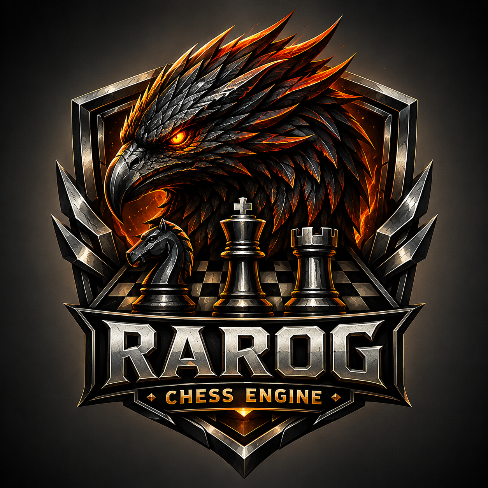

# Rarog

<p align="center">
  
</p>

Rarog is a UCI-compatible chess engine written in Rust.
The engine is intended for use from a chess GUI or engine-testing tool that
speaks the UCI protocol.

Rarog was released as Lynx through version `1.4.3`. The project was renamed
starting with version `2.0.0` to avoid confusion with an existing chess engine.

---

## Highlights

- Custom bitboard board representation with incremental make/unmake
- Legal move generation for all standard chess rules, including castling,
  en passant, promotions, repetition, the fifty-move rule, and insufficient
  material detection
- Strict FEN validation with canonical en passant hashing so positions without
  a legal en passant capture share the same transposition key
- Zobrist hashing, transposition table, and pawn evaluation cache
- Iterative deepening negamax/PVS search with aspiration windows
- Configurable Lazy SMP-style parallel search with persistent workers, shared
  stop/node/accounting state, weighted helper result selection, and a full-key
  validated shared transposition table through the UCI `Threads` option
- Capture-focused quiescence search with delta pruning, capture futility,
  threshold SEE pruning, and bounded check evasions
- Null-move pruning (cut-node only) with verification, improving-aware
  ProbCut, singular extensions, futility pruning, late move pruning, quiet
  SEE pruning, and fractional history-weighted late move reductions with
  do-deeper/do-shallower re-search depth adjustment
- Staged move picking with a validated TT move first, good captures before lazy
  quiet generation, and bad captures delayed until after quiet moves
- Move ordering using TT moves, threshold SEE, killers, countermoves, main
  history, eight-ply low-ply history, pawn history, capture history,
  continuation history, and a direct-check bonus for quiet checking moves
- Direct legal validation for raw UCI and TT-shaped moves, including
  canonicalized captures, castling, en passant, and promotions
- Multi-table and continuation correction history with handcrafted tapered
  evaluation and fifty-move-rule dampening
- Soft/hard time allocation with `movestogo`, increment, and move-overhead
  handling
- Optional Syzygy tablebase probing through the UCI `SyzygyPath`,
  `SyzygyProbeDepth`, `SyzygyProbeLimit`, and `Syzygy50MoveRule` options,
  with root DTZ ranking, WDL fallback, load summaries, and `tbhits` reporting
- Built-in `bench` UCI command for repeatable search benchmarks

---

## UCI Support

Supported commands include:

- `uci`
- `isready`
- `ucinewgame`
- `position startpos [moves ...]`
- `position fen <fen> [moves ...]`
- `go` with `depth`, `nodes`, `movetime`, `wtime`, `btime`, `winc`, `binc`,
  `movestogo`, `mate`, `searchmoves`, `ponder`, `perft`, and `infinite`
- `stop`
- `ponderhit`
- `quit`
- `bench [depth]`

Supported options:

- `Hash` default `64`
- `Clear Hash`
- `Ponder` default `false`
- `Move Overhead` default `10`
- `Threads` default `1`, min `1`, max `1024`
- `SyzygyPath` default empty
- `SyzygyProbeDepth` default `1`, min `1`, max `100`
- `SyzygyProbeLimit` default `7`, min `0`, max `7`
- `Syzygy50MoveRule` default `true`

`SyzygyPath` may contain one or more Syzygy directories separated by the
platform path separator (`;` on Windows, `:` on Unix-like systems). When the
path is empty, tablebase probing is disabled. Rarog uses WDL probes inside the
search and DTZ-ranked root probing when DTZ tables are available. If root DTZ
probing is unavailable but WDL tables are present, Rarog falls back to WDL root
move filtering. Search info includes `tbhits` when tablebase probes are used.
Set `SyzygyProbeLimit` to `0` to disable probing without changing the path.

---

## Bench

Run the built-in benchmark from a UCI session:

```text
bench
bench 13
```

The bench command searches a fixed suite of positions and reports a repeatable
search fingerprint and speed data. It is useful for comparing local changes,
compiler settings, and machine performance.

The benchmark uses the current UCI options, including `Threads`, so a threaded
search benchmark can be run with:

```text
setoption name Threads value 8
bench
```

Run the board implementation benchmark with:

```bash
cargo bench --bench board
```

This benchmark measures legal move generation, direct legal move validation,
capture generation, make/unmake, check detection, SEE over captures,
game-simulation-style move generation, and start-position perft depth 4.

---

## Build From Source

Install Rust and Cargo, then build an optimized release binary:

```bash
cargo build --release
```

The executable is created at:

- `target/release/rarog`
- `target/release/rarog.exe` on Windows

Release builds use LTO and a single codegen unit for engine speed.
Local release builds also use `target-cpu=native`, so `cargo build --release`
optimizes Rarog for the CPU on the build machine.

Portable release-asset builds can be produced with the cross-platform `xtask`
helper:

```bash
cargo xtask build
cargo xtask build --arch avx2
cargo xtask build --arch pext
cargo xtask build --arch arm64
```

`cargo xtask build` defaults to the compatible x86-64 asset on x86-64 hosts and
to the ARM64 asset on ARM64 hosts. The helper writes renamed binaries to
`target/dist`.

Profile-guided optimization can be enabled for a native target:

```bash
cargo xtask build --arch pext --pgo
```

PGO builds first create an instrumented engine, train it with the built-in
`bench` command, merge the generated LLVM profile, and rebuild the optimized
binary. PGO assets add `-pgo` before the executable suffix, so they do not
overwrite non-PGO builds. Use `--bench-depth <n>` to adjust the training
workload. The helper installs the Rust target with `rustup target add` when
`rustup` is available. For PGO it also looks for `llvm-profdata` and attempts
`rustup component add llvm-tools-preview` if the tool is missing.

For quick local testing:

```bash
cargo run --release
```

---

## Test

Run the release test suite:

```bash
cargo test --release
```

The suite covers:

- FEN parsing and round-tripping
- Strict FEN legality checks, castling-right validation, and en passant
  canonicalization
- Legal move generation and special moves
- Direct legal move validation for raw UCI/TT-shaped moves
- Perft reference positions
- Hashing and make/unmake correctness
- Incremental pawn, minor-piece, and non-pawn structure keys
- Draw and terminal-result handling
- Insufficient-material draw handling at search root and interior nodes
- Legal `bestmove` reporting from root draw positions where legal moves still
  exist
- Search limits, invalid limit parsing, and stop/quit behavior
- UCI `go searchmoves` root filtering and `go mate` depth conversion
- Time-management behavior for fast clocks, `movetime`, side-to-move clocks,
  explicit `movestogo`, and unbounded fixed-depth searches
- Single-thread determinism and thread-count reconfiguration
- Threaded search node-limit, stop, quit, UCI info accounting, and
  ponderhit behavior
- Threshold SEE behavior for captures and promotions
- Staged move-picker ordering for bad captures after quiet moves
- Direct-check quiet move-ordering bonus
- Eight-ply low-ply history scoring and update boundaries
- Syzygy option parsing, result decoding, root move conversion, root tablebase
  probing, tablebase path counting, and disabled-path probe behavior
- UCI command ordering, priority quit/stop handling, and stale-search
  cancellation
- UCI ponder and infinite-search `bestmove` release timing
- UCI PV replay legality for tournament-derived TT/hash-move regression
  positions at one and eight search threads
- FEN compatibility for tournament managers that emit non-standard fullmove `0`
- Quiet/capture move-generation partitioning
- Evaluation and transposition table behavior
- Current-generation `hashfull` accounting for local and shared transposition
  tables
- Fifty-move-rule evaluation dampening
- Rule-50-aware transposition-table mate score recovery
- TT-first move-picker behavior and TT-derived ponder fallback
- UCI command handling and invalid `setoption` preservation

---

## Use With A GUI

1. Build or download a Rarog executable.
2. Add it as a UCI engine in your chess GUI.
3. Configure `Hash` and `Move Overhead` as needed.
4. Start an engine game or analysis session.

Tested GUI families include Arena, ChessBase/Fritz, ChessOK Aquarium, and
Hiarcs Chess Explorer. Other UCI-compatible GUIs should also work.

---

## Releases

Current documented release: `2.1.0`.

`2.1.0` is the current minor release, delivering a substantial search overhaul for higher
playing strength. The integer ±1 LMR adjustment system is replaced by a
1024-scaled fractional system with nine history- and correction-aware weighted
terms, paired with do-deeper/do-shallower re-search depth adjustment. Additional
changes include history- and correction-weighted pruning thresholds across RFP,
futility, and LMP, a new quiet SEE prune, cutoff-count tracking feeding back
into reductions, null-move pruning restricted to cut nodes, quadratic razoring,
and an improving-aware ProbCut margin. Bench fingerprint: 3,605,789 nodes.

`2.0.1` is a patch release delivering search improvements for higher playing
strength. Changes include IIR for PV nodes, negative history updates for good
captures searched before a beta cutoff, correction history updates for Lower and
Upper bound nodes, and a unified capture history bonus formula.

`2.0.0` renames the project from Lynx to Rarog. The UCI engine identity,
Cargo package, executable names, release assets, repository metadata, and
documentation now use the Rarog name. Lynx releases remain available through
`1.4.3`.

- [Latest release](https://github.com/maelic13/rarog/releases/latest)
- [All releases](https://github.com/maelic13/rarog/releases)

Source releases include the engine source, tests, benchmarks, release workflow,
`xtask` asset builder, bundled Fathom tablebase probing code, logos,
documentation, and the committed `Cargo.lock` for reproducible dependency
resolution. Local IDE state, assistant state, build output, package staging, and
generated tuning artifacts are ignored and are not part of a release.

Release-preparation checks for `2.1.0`:

```bash
cargo fmt --check
cargo check --release
cargo test --release
cargo xtask build --arch avx2 --target x86_64-pc-windows-msvc
cargo xtask build --arch avx2 --target x86_64-pc-windows-msvc --pgo
```

The final Lynx-branded release was `1.4.3`. It was checked with internal
`bench 13`, PGO/non-PGO speed comparisons, and Cutechess regression matches
against the 1.4.2 development baseline and Basilisk 1.4.9. Bench-only PGO
remained faster than the tested Lynx-specific EPD PGO profile on the final
1.4.3 code, so the release build helper keeps bench-only PGO training.

Release assets may include standalone executables for Windows, Linux, and
Apple Silicon macOS. Intel macOS release assets are not published.
GitHub release binaries are built with explicit portable CPU targets instead of
`target-cpu=native`, so they can be shared safely. Local `cargo build --release`
builds continue to use `target-cpu=native` through `.cargo/config.toml`.

Use the most advanced binary your CPU supports:

| Asset suffix | Use when |
| --- | --- |
| `x86-64` | You need the most compatible Intel/AMD 64-bit build. |
| `avx2` | Your Intel/AMD CPU supports x86-64-v3/AVX2; this is the usual optimized x64 choice. |
| `pext` | Your Intel/AMD CPU supports BMI2/PEXT; benchmark it against `avx2` on your CPU. |
| `arm64` | You are on ARM64 Linux, Windows on ARM, or Apple Silicon macOS. |

If unsure, use the plain `x86-64` or `arm64` asset for your operating system.

---

## License

GPL-3.0-or-later. See [LICENSE](LICENSE).

---

## Acknowledgements

Rarog is an independent engine, but it benefits from the open chess-engine
community's published ideas, testing practices, and protocol conventions.
Special thanks to Stockfish and its team for the inspiration their work provides
to chess engine authors and testers.
